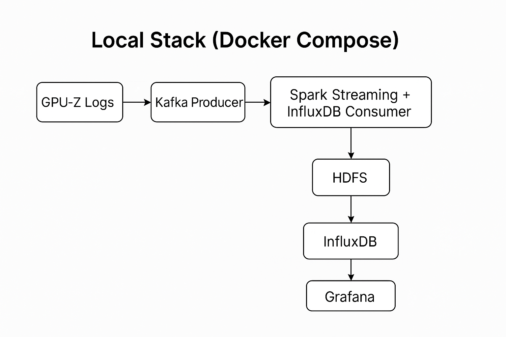
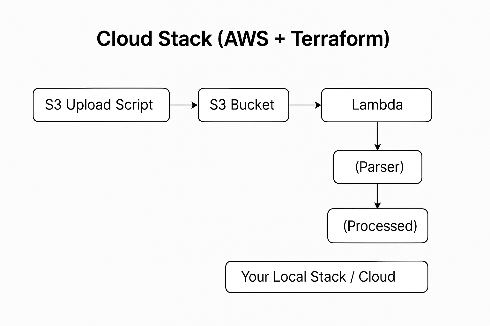

# GPU Monitoring Dashboard

A real-time GPU and CPU monitoring system using **Kafka**, **Spark Streaming**, **Hadoop (HDFS)**, and **Grafana** for visualization. This project processes GPU-Z sensor logs to provide real-time metrics and historical analytics.

**🆕 NEW: AWS Terraform Infrastructure** - Deploy serverless processing with S3 + Lambda (100% free tier compliant!)

## Architecture

### Local Stack (Docker Compose)



The local stack processes GPU-Z logs through Kafka, stores data in HDFS and InfluxDB, and visualizes metrics in Grafana.

### Cloud Stack (AWS + Terraform)



The cloud stack uploads logs to S3, processes them via Lambda, and integrates with your local or cloud infrastructure.

**👉 [Terraform Quick Start](docs/QUICKSTART.md)** - Deploy to AWS in 5 minutes!

### Components

#### Local Stack
- **Kafka**: Message broker for streaming GPU metrics
- **Spark Streaming**: Real-time processing and anomaly detection
- **Hadoop (HDFS)**: Historical data storage
- **InfluxDB**: Time-series database for metrics
- **Grafana**: Real-time visualization dashboard
- **Zookeeper**: Kafka coordination

#### Cloud Stack (Optional) 🆕
- **AWS S3**: Raw and processed log storage
- **AWS Lambda**: Serverless log processing (Python)
- **Terraform**: Infrastructure as Code
- **CloudWatch**: Monitoring and logging
- **IAM**: Security and access control
- **100% Free Tier**: $0.00/month for first 12 months

## Features

### Real-time Monitoring
- GPU temperature, load, and clock speeds
- CPU temperature
- Power consumption and voltage
- Memory usage (GPU and system)
- Fan speeds
- Anomaly detection (high temps, high loads, high power)

### Historical Analytics
- Daily statistics and trends
- Hourly usage patterns
- Temperature spike detection
- Correlation analysis between metrics
- Power consumption tracking

### Dashboards
- Real-time metrics visualization in Grafana
- Custom alerts for anomalies
- Historical trend analysis

## Prerequisites

- Docker and Docker Compose
- Python 3.8+ (for running scripts outside Docker)
- At least 8GB RAM recommended
- GPU-Z log file

## Quick Start

### 1. Clone and Navigate to Project

```bash
cd gpu-monitoring-dashboard
```

### 2. Copy Your GPU-Z Log File

Copy your `GPU-Z Sensor Log.txt` to the project directory:

```bash
cp "/path/to/GPU-Z Sensor Log.txt" ./data/
```

### 3. Start All Services

```bash
docker-compose up -d
```

Wait for all services to start (this may take 2-3 minutes). Check status:

```bash
docker-compose ps
```

### 4. Verify Services

- **Kafka**: http://localhost:9092
- **Spark Master UI**: http://localhost:8080
- **Hadoop Namenode UI**: http://localhost:9870
- **InfluxDB UI**: http://localhost:8086
- **Grafana UI**: http://localhost:3000 (admin/admin)

### 5. Install Python Dependencies

```bash
cd kafka-producer
pip install -r requirements.txt
```

### 6. Start Streaming Pipeline

**Terminal 1 - Start Kafka Producer:**
```bash
cd kafka-producer
python gpuz_producer.py --file "../data/GPU-Z Sensor Log.txt" --broker localhost:9092 --speed 1.0 --loop
```

Options:
- `--speed`: Replay speed (1.0 = real-time, 2.0 = 2x faster)
- `--loop`: Loop the log file when it ends

**Terminal 2 - Start InfluxDB Consumer:**
```bash
cd kafka-producer
python influxdb_consumer.py --kafka-broker localhost:9092 --influx-url http://localhost:8086
```

**Terminal 3 - Start Spark Streaming (Optional - for HDFS storage):**
```bash
docker exec -it spark-master /bin/bash
cd /opt/spark-jobs
pip install -r requirements.txt
spark-submit --packages org.apache.spark:spark-sql-kafka-0-10_2.12:3.5.0 streaming_processor.py --broker kafka:9093
```

### 7. Access Grafana Dashboard

1. Open http://localhost:3000
2. Login: `admin` / `admin`
3. Go to **Dashboards** → **Create** → **New Dashboard**
4. Add panels with InfluxDB queries:

**Example Query for GPU Temperature:**
```flux
from(bucket: "gpu-metrics")
  |> range(start: -1h)
  |> filter(fn: (r) => r["_measurement"] == "gpu_metrics")
  |> filter(fn: (r) => r["_field"] == "gpu_temperature")
```

**Example Query for CPU Temperature:**
```flux
from(bucket: "gpu-metrics")
  |> range(start: -1h)
  |> filter(fn: (r) => r["_measurement"] == "gpu_metrics")
  |> filter(fn: (r) => r["_field"] == "cpu_temperature")
```

## Running Batch Analytics

To analyze historical data stored in HDFS:

```bash
docker exec -it spark-master /bin/bash
cd /opt/spark-jobs
pip install -r requirements.txt
spark-submit batch_analytics.py --input /gpu-metrics --output /gpu-analytics
```

This will generate:
- Daily statistics
- Hourly patterns
- Temperature spike detection
- Correlation analysis

Results are saved to HDFS and displayed in the console.

## Project Structure

```
gpu-monitoring-dashboard/
├── docker-compose.yml          # Docker services configuration
├── automated_pipeline.py       # Main pipeline orchestration script
├── load_s3_to_influxdb_v2.py  # S3 to InfluxDB data loader
├── .env.example               # Environment variables template
├── requirements.txt           # Python dependencies
├── docs/                      # Documentation
│   ├── images/                # Architecture diagrams
│   ├── QUICKSTART.md         # Quick start guide
│   ├── GIT_SETUP.md          # Git setup instructions
│   └── *.md                  # Other documentation
├── scripts/                   # Helper scripts
│   ├── *.ps1                 # PowerShell scripts
│   ├── *.sh                  # Bash scripts
│   └── *.bat                 # Windows batch scripts
├── terraform/                 # AWS infrastructure
│   ├── main.tf               # Terraform configuration
│   ├── lambda/               # Lambda function code
│   └── *.md                  # Terraform documentation
├── kafka-producer/
│   ├── gpuz_producer.py      # Kafka producer for GPU-Z logs
│   ├── influxdb_consumer.py  # Consumer writing to InfluxDB
│   └── requirements.txt      # Python dependencies
├── spark-jobs/
│   ├── streaming_processor.py # Spark Streaming job
│   ├── batch_analytics.py    # Batch analytics job
│   └── requirements.txt      # Python dependencies
├── dashboard/
│   ├── *.json                # Grafana dashboard definitions
│   └── provisioning/         # Grafana auto-provisioning
├── kubernetes/               # Kubernetes manifests
│   └── *.yaml               # K8s deployment configs
└── docker/                   # Docker configurations
```

## Monitoring Metrics

### GPU Metrics
- GPU Clock Speed (MHz)
- Memory Clock Speed (MHz)
- GPU Temperature (°C)
- Hot Spot Temperature (°C)
- Memory Temperature (°C)
- GPU Load (%)
- Memory Used (MB)
- Board Power Draw (W)
- GPU Chip Power Draw (W)
- GPU Voltage (V)

### CPU Metrics
- CPU Temperature (°C)
- System Memory Used (MB)

### Fan Metrics
- Fan 1/2 Speed (%)
- Fan 1/2 Speed (RPM)

### Power Metrics
- Board Power Draw (W)
- Power Consumption (% TDP)
- PCIe Slot Power (W)
- 8-Pin Connector Powers (W)

## Anomaly Detection

The system automatically detects:
- **High GPU Temperature**: > 85°C
- **High CPU Temperature**: > 80°C
- **High Power Draw**: > 300W
- **High GPU Load**: > 95%

Alerts are tagged in the data and can be visualized in Grafana.

## Grafana Dashboard Examples

### Recommended Panels

1. **GPU Temperature (Time Series)**
   - Show GPU temp, hot spot, and memory temp over time

2. **CPU Temperature (Time Series)**
   - Track CPU temperature trends

3. **GPU Load (Gauge)**
   - Current GPU utilization

4. **Power Consumption (Time Series)**
   - Board power draw over time

5. **Memory Usage (Time Series)**
   - GPU memory and system memory

6. **Clock Speeds (Time Series)**
   - GPU and memory clock speeds

7. **Alerts (Stat Panel)**
   - Count of anomalies detected

## Troubleshooting

### Services Won't Start
```bash
# Check logs
docker-compose logs kafka
docker-compose logs spark-master
docker-compose logs influxdb

# Restart services
docker-compose restart
```

### Kafka Connection Issues
```bash
# Check if Kafka is ready
docker exec -it kafka kafka-topics --list --bootstrap-server localhost:9093

# Create topic manually
docker exec -it kafka kafka-topics --create --topic gpu-metrics --bootstrap-server localhost:9093 --partitions 1 --replication-factor 1
```

### No Data in Grafana
1. Check InfluxDB has data:
   - Visit http://localhost:8086
   - Login with admin/adminpassword
   - Go to Data Explorer
   - Query the gpu-metrics bucket

2. Verify consumer is running:
   ```bash
   # Check consumer logs
   ps aux | grep influxdb_consumer
   ```

3. Check Grafana datasource connection:
   - Go to Configuration → Data Sources
   - Test the InfluxDB connection

### HDFS Connection Issues
```bash
# Check HDFS status
docker exec -it namenode hdfs dfsadmin -report

# List files
docker exec -it namenode hdfs dfs -ls /
```

## Stopping the System

```bash
# Stop all services
docker-compose down

# Stop and remove volumes (WARNING: deletes all data)
docker-compose down -v
```

## Performance Tuning

### For High-Frequency Data

Edit [docker-compose.yml](docker-compose.yml):

```yaml
spark-worker:
  environment:
    - SPARK_WORKER_MEMORY=4G  # Increase memory
    - SPARK_WORKER_CORES=4    # Increase cores
```

### For Large Historical Data

Increase Hadoop datanode storage:

```yaml
volumes:
  hadoop_datanode:
    driver: local
    driver_opts:
      type: none
      device: /path/to/large/disk
      o: bind
```

## Advanced Features

### Real-time Alerting

Modify [streaming_processor.py](spark-jobs/streaming_processor.py) to add custom alert logic:

```python
def detect_critical_alerts(df):
    return df.withColumn(
        "critical_alert",
        when(
            (col("GPU Temperature") > 90) |
            (col("Board Power Draw") > 350),
            True
        ).otherwise(False)
    )
```

### Custom Metrics

Add new metrics to [gpuz_producer.py](kafka-producer/gpuz_producer.py) parsing logic.

### Export Analytics Results

Results can be exported from HDFS:

```bash
docker exec -it namenode hdfs dfs -get /gpu-analytics /tmp/
docker cp namenode:/tmp/gpu-analytics ./exported-analytics/
```

## Contributing

Feel free to extend this project with:
- Additional visualization panels
- More sophisticated anomaly detection (ML-based)
- Alert notifications (email, Slack, etc.)
- Web-based control panel
- Support for multiple GPUs

## License

MIT License - Feel free to use and modify for your needs!

## Credits

Built with:
- Apache Kafka
- Apache Spark
- Apache Hadoop
- InfluxDB
- Grafana
- GPU-Z by TechPowerUp
